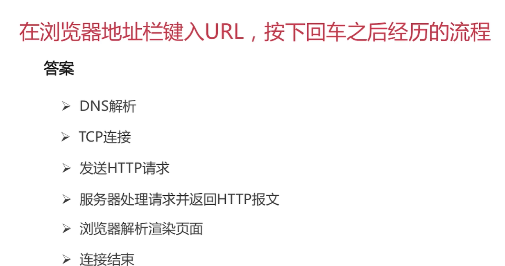

1.OSI开放式互联参考模型

```
七层协议：
物理层：定义了物理设备标准；主要目的：传输比特流，数模转换和模数转换，网卡工作在物理层。【比特流】
数据链路层：定义了如何格式化数据进行传输，如何控制对物理介质的访问；提供错误检测和纠正，确保数据传输的可靠性。【数据帧】交换机。
网络层：将网络地址翻译成对应的物理地址。【数据包】路由器   ip协议。
传输层：传输协议、进行流量控制，保证数据段有效到达。【数据段】
会话层：建立管理应用程序之间的通信。
表示层：信息的语法语义以及他们的关联。
应用层：

```

<!--more-->


2.TCP/IP

​    

3.TCP的简介

```
TCP：面向连接的、可靠的、基于字节流的传输层通信协议
	将应用层的数据流分割成报文段并发送给目标节点的TCP层
	数据包都有序号，对方收到则发送ACK确认，未收到则重传
	使用校验和来检验数据在传输过程中是否有错误
套接字socket：ip地址+协议+port    标识一个进程
TCP Flag： URG ACK PSH(push标志) RST  SYN  FIN
window窗口：告知发送端和接收端的缓存大小，流量控制
```

​    

4.TCP三次握手（建立连接）：

```
第一次握手：【SYN】客户端->服务器，客户端进入SYN_SEND状态；
第二次握手：【SYN,ACK】服务器->客户端，服务端进入SYN_RECV状态；
第三次握手：【ACK】客户端->服务器，客户端进入ESTAB-LISHED，服务器收到后也进入ESTAB-LISHED状态。
```

​     

   为什么需要三次握手？

```
为了初始化SEQUENCE Number的初始值
```

​    首次握手的隐患问题：

```
问题：当服务器收到客户端的SYN，回复给客户端后，未收到客户端的ACK。
服务器布顿啊重试直至超时，Linux默认63秒才断开连接（LINUX默认重发五次 1+2+4+8+16=31s,31s+32s(第五次发出去，还需等待32s才能判断超时)=63s)

针对SYN Flood的防护措施：
linux中当SYN队列满了后，通过tcp_syncookies参数回发SYN Cookie
若为正常连接则Client回回发SYN Cookie，直接建立连接。
```

​     tcp 保活机制：（已建立连接，客户端出现故障）

```
向对方发送保活探测报文，如未收到响应则继续发送
尝试次数达到保活探测术仍未收到响应，对方主机被确认为不可达，建立被中断。
```

   5.TCP的四次挥手（终止连接）：

```
1.【FIN】C->S，C进入FIN_WAIT-1
2.【ACK】S—>C，S进入CLOSED-WAIT
3.【FIN,ACK】S—>C，S进入LAST-ACK
4.【ACK】S进入Closed状态，C等待2MSL进入Closed状态

S--被动方   C主动方
```

​       

TCP连接为什么必须经过时间2MSL后才真正释放掉？

```
1.确保有足够的时间让对端收到ACK
2.避免新旧连接混淆
```

为什么需要四次挥手端口连接？

```
因为TCP是全双工的，发送方和接收方都需要FIN和ACK报文。
有一方是被动的，所以是四次。
```

Linux服务器出现大量CLOSE_WAIT状态的原因：

```
因为客户端发送大量的请求，返回给客户端的是异常的，服务器压根没收到请求。
对方关闭socket连接后，另一方没有检测到或者忘了关闭连接。
  >程序bug，未释放
  >线程池中线程数不合理

```

6.UDP

```
UDP： 1.面向非连接 2.不维护连接状态 3.数据包只有8个字节 4.吞吐量只受限于数据生成速率和传输速率以及机器性能 5.尽最大努力交付， 6.保证可靠交付，不需要维持链接状态表 7.面向报文，不需要拆分或合并报文信息
```

​      TCP与UDP区别

```
1.面向连接      无连接
2.可靠性        
3.有序性 序列号回排序    无序
4.tcp慢，创建连接    udp快 用于在线视频广播游戏等
5，tcp重量级  udp轻量级
```

7.TCP滑动窗口：

```
RTT和RTO：
  RTT：发出数据包到接收到ACK的时间
  RTO：重传时间间隔
TCP滑动窗口作用：
	可靠性
	流量控制

```


8.HTTP超文本传输协议

```
特点 ：
支持客户/服务器模式、简单快速、灵活、无连接（每次连接执行只处理一个请求）、无状态
```

 HTTP响应步骤：

```
客户端连接到Web服务器
发送HTTP请求
服务器接受请求并返回HTTP响应
释放TCP连接
客户端浏览器解析HTML内容
```

  

状态码：


 GET请求和POST请求的区别

```
Http报文层面:GET将请求信息放在URL,POST放在体内
数据库层面：GET符合幂等性（一次请求和多次请求结果一致）和安全性（对数据库操作不会改变数据），POST不符合
其他：GET可以被缓存、存储，POST不行
```

Cookie和Session区别：

```
Cookie：服务器发给客户端的特殊信息，以文本形式存储在客户端
		客户端再次请求时会回发Cooike
		服务器接收到，会解析Cookie 生成与客户端相应的内容
```

  

```
Session：服务器端的机制，保存在服务器
		解析客户端请求操作session id，按需保存状态信息
```


```
COOKIE与SESSION的区别：
1.Cookie数据存放在客户的浏览器上，Session数据存放在服务器上
2.Session相对于Cookie更安全（Cookie欺骗）
3.若考虑减轻服务器负担，应当使用Cookie（Session太多占有服务器性能）
```

9.HTTPS与HTTP区别：


```
SSL 安全套接层（3.0后更名为TLS）
采用身份认证和数据加密保证网络通信安全和数据完整性
加密方式：
对称加密、非对称加密、哈希算法、数字签名
```

​      HTTPS数据传输流程：


> HTTP与HTTPS区别：
>
> ```
> HTTPS需要到CA申请整数，HTTP不需要
> HTTPS密文传输，HTTP明文传输
> HTTPS:443,HTTP:80
> HTTPS=HTTP+加密+认证+完整性保护
> ```
>
> ```
> HTTPS未必很安全，由于一些客户在输入时不输入http或https，由浏览器自动填充，浏览器默认填充http。再有301或302转到https。所以在此过程中还是用到了http，所以可能不安全。
> HSTS
> ```
>
> 

10.Socket：


